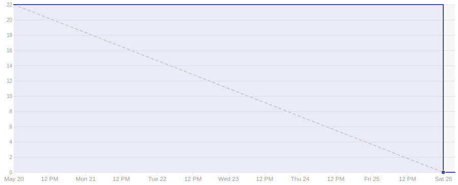

# Sprint 11

## Duração

De 20 de Maio de 2018 (20/05/2018) à 26 de Maio de 2018 (26/05/2018).

## Atividade planejadas

|Issue| Descrição|Pontuação|Origem|Resultado|
|-|-|-|-|-|
|([#115](https://github.com/fga-gpp-mds/2018.1-VoxPop-WebApp/issues/115))|BF04 - User Following|3|Nova|Sucesso|
|([#108](https://github.com/fga-gpp-mds/2018.1-VoxPop-WebApp/issues/))|BF05 - Atualizar regex de senha |2|Nova|Sucesso|
|([#79](https://github.com/fga-gpp-mds/2018.1-VoxPop-API/issues/79))|Gerar estatística de deputados com mais seguidores|3|Nova|Sucesso|
|([#78](https://github.com/fga-gpp-mds/2018.1-VoxPop-API/issues/78))|Gerar estatística de deputados mais ativos |3|Nova|Sucesso|
|([#77](https://github.com/fga-gpp-mds/2018.1-VoxPop-API/issues/77))|Criar objetos de voto de uma votação de uma vez |3|Nova|Sucesso|
|([#76](https://github.com/fga-gpp-mds/2018.1-VoxPop-API/issues/76))|Passar a pegar somente proposições com votações|5|Nova|Sucesso|
|([#74](https://github.com/fga-gpp-mds/2018.1-VoxPop-API/issues/74))|BF04 - Income|3|Nova|Sucesso|
|([#71](https://github.com/fga-gpp-mds/2018.1-VoxPop-API/issues/71))|Implementar busca nos deputados seguidos|2|Nova|Falha|

## Produtividade
** Pontos planejados:** 24
 
** Pontos entregues:** 22

# Burndown

# Métricas API
|Métricas|Indicadores|
|-|-|
| **Erros do flake8 por arquivo** | 0 |
| **Métodos com alto número de argumentos** | 0 |
| **Arquivos com alto número de linhas** | 0 |
| **Blocos de código idênticos** | 0 |
| **Blocos de código semelhantes** | 15 |
| **Classes com alto número de métodos** | 0 |
| **Métodos com alto número de linhas** | 0 |
| **Quantidade de estruturas de decisão muito aninhadas** | 2 |
| **Métodos com vários 'return'** | 0 |

# Métricas WebApp
|Métricas|Indicadores|
|-|-|
| **Métodos com alto número de argumentos** | 0 |
| **Arquivos com alto número de linhas** | 3 |
| **Blocos de código idênticos** | 7 |
| **Blocos de código semelhantes** | 10 |
| **Classes com alto número de métodos** | 4 |
| **Métodos com alto número de linhas** | 2 |
| **Quantidade de estruturas de decisão muito aninhadas** | 0 |
| **Métodos com vários 'return'** | 2 |

# Retrospectiva

## O que foi bom
- Bugs foram corrigidos
- Recebemos feedback de usuários
- Testes de usabilidade
- Começamos modulo de estatísticas

## O que foi ruim
- Greve dos caminhoneiros
- Produtividade caiu
- Rituais do scrum não foram seguidos
- Não houve entrega contínua
- PRs só sairam na reunião de sábado
- Adiquirimos dívida técnica

## O que pode melhorar
- Consideração de imprevistos no planejamento
- Comunicação
- Entrega contínua

### Análise do Scrum Master
Durante esta sprint ocorreram diversos problemas com relação aos rituais e pareamentos devido a greve dos camioneiros, com isso além de uma queda na produtividade houve também uma aquisição de dívida técnica de 2 pontos. Foi iniciada a entrega de histórias de estatísticas e finalizadas as histórias relacionadas a votação de proposições. Devidio as dificuldades encontradas em se reunir houve uma má gestão do tempo e as práticas ágeis não foram seguidas como esperado.

[Voltar](./../)
