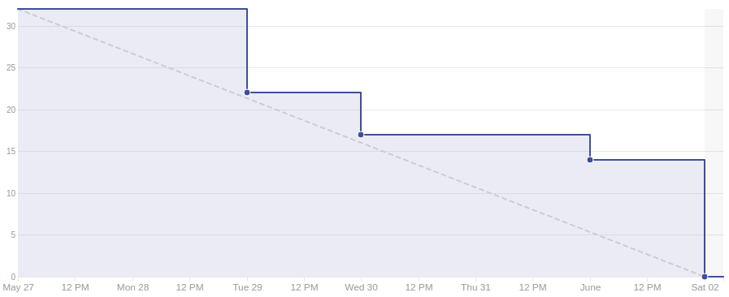

# Sprint 12

## Duração

De 27 de Maio de 2018 (27/05/2018) à 02 de Junho de 2018 (02/06/2018).

## Atividade planejadas

|Issue| Descrição|Pontuação|Origem|Resultado|
|-|-|-|-|-|
|([#122](https://github.com/fga-gpp-mds/2018.1-VoxPop-WebApp/issues/122))|Refatorar aparência das páginas|8|Nova|Sucesso|
|([#121](https://github.com/fga-gpp-mds/2018.1-VoxPop-WebApp/issues/121))|USF - Implementar busca nos deputados seguidos|3|Nova|Sucesso|
|([#120](https://github.com/fga-gpp-mds/2018.1-VoxPop-WebApp/issues/120))|Colocar logo na aplicação (favicon) |1|Nova|Sucesso|
|([#119](https://github.com/fga-gpp-mds/2018.1-VoxPop-WebApp/issues/119))|Arrumar chamadas do endpoint de proposição não votada|2|Nova|Sucesso|
|([#74](https://github.com/fga-gpp-mds/2018.1-VoxPop-WebApp/issues/74))|USF21 - Listar deputados mais ativos|2|Nova|Sucesso|
|([#84](https://github.com/fga-gpp-mds/2018.1-VoxPop-API/issues/84))|Implementar algoritmo de compatibilidade política|8|Nova|Sucesso|
|([#83](https://github.com/fga-gpp-mds/2018.1-VoxPop-API/issues/83))|Ordenar most_active e most_followed por ordem alfabética|3|Nova|Sucesso|
|([#82](https://github.com/fga-gpp-mds/2018.1-VoxPop-API/issues/82))|Fazer endpoint de proposição não votada pelo usuário só mostrar proposições votadas por parlamentar|3|Nova|Sucesso|
|([#71](https://github.com/fga-gpp-mds/2018.1-VoxPop-API/issues/71))|Implementar busca nos deputados seguidos|2|Sprint 11|Sucesso|

## Produtividade
** Pontos planejados:** 32
 
** Pontos entregues:** 32

# Burndown

# Métricas API
|Métricas|Indicadores|
|-|-|
| **Erros do flake8 por arquivo** | 0 |
| **Métodos com alto número de argumentos** | 0 |
| **Arquivos com alto número de linhas** | 0 |
| **Blocos de código idênticos** | 0 |
| **Blocos de código semelhantes** | 8 |
| **Classes com alto número de métodos** | 1 |
| **Métodos com alto número de linhas** | 1 |
| **Quantidade de estruturas de decisão muito aninhadas** | 0 |
| **Métodos com vários 'return'** | 0 |

# Métricas WebApp
|Métricas|Indicadores|
|-|-|
| **Métodos com alto número de argumentos** | 0 |
| **Arquivos com alto número de linhas** | 0 |
| **Blocos de código idênticos** | 0 |
| **Blocos de código semelhantes** | 12 |
| **Classes com alto número de métodos** | 0 |
| **Métodos com alto número de linhas** | 0 |
| **Quantidade de estruturas de decisão muito aninhadas** | 0 |
| **Métodos com vários 'return'** | 0 |

# Retrospectiva

## O que foi bom
- Dívida técnica paga
- Foi entregue todo o planejado
- Produtividade subiu
- Membros trabalhando juntos
- Melhora no burndown
- Resultados dos testes de usabilidade utilizados
- Danos da greve dos caminhoneiros mitigados
- Rituais do Scrum foram seguidos
- Entrega contínua

## O que foi ruim
- Greve dos caminhoneiros
- Conhecimento da compatibilidade não nivelado
- MDS muito dependente de EPS

## O que pode melhorar
- Nivelamento do conhecimento
- Distribuição do trabalho

### Análise do Scrum Master
Com a continuação da greve dos caminhoneiros e aulas canceladas, as reuniões e rituais presenciais foram comprometidos, impedindo uma comunicação efetiva da equipe, porém após o resultado insatisfatório da sprint anterior foi realizado o planejamento com isso em mente e fomos capazes não somente de aumentar a produtividade como acabar com a dívida técnica adiquirida anteriormente. A equipe também mostrou grande amadurecimento e as praticas ágeis esperadas foram seguidas completamente.

[Voltar](./../)
