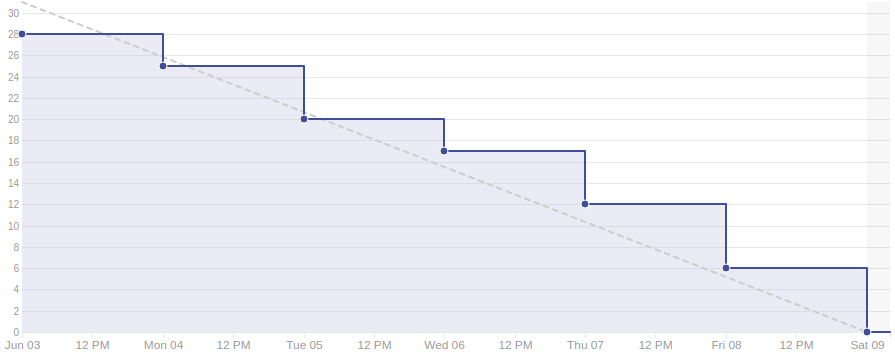

# Sprint 13

## Duração

De 03 de Junho de 2018 (03/06/2018) à 09 de Junho de 2018 (09/06/2018).

## Histórias de Usuário concluídas

|Issue| Descrição|Pontuação|Origem|Resultado|
|-|-|-|-|-|
|([#131](https://github.com/fga-gpp-mds/2018.1-VoxPop-WebApp/issues/131))|Redirecionar para a tela de Login após cadastro|2|Nova|Sucesso|
|([#130](https://github.com/fga-gpp-mds/2018.1-VoxPop-WebApp/issues/130))|USF23 - Ver caixas de explicação |3|Nova|Sucesso|
|([#129](https://github.com/fga-gpp-mds/2018.1-VoxPop-WebApp/issues/129))|USF22 - Ver ranking de compatibilidade|3|Nova|Sucesso|
|([#127](https://github.com/fga-gpp-mds/2018.1-VoxPop-WebApp/issues/127))|BF07/Register |3|Nova|Sucesso|
|([#126](https://github.com/fga-gpp-mds/2018.1-VoxPop-WebApp/issues/126))|BF06 - Duplicata de Paginação em My-Pls|3|Nova|Sucesso|
|([#53](https://github.com/fga-gpp-mds/2018.1-VoxPop-WebApp/issues/53))|USF18 – Ver Estatísticas de uma proposição|3|Nova|Sucesso|
|([#52](https://github.com/fga-gpp-mds/2018.1-VoxPop-WebApp/issues/52))|USF17 – Ver Compatibilidade Política|3|Nova|Sucesso|
|([#89](https://github.com/fga-gpp-mds/2018.1-VoxPop-API/issues/89))|USB22 - Ver ranking de compatibilidade|3|Nova|Sucesso|
|([#33](https://github.com/fga-gpp-mds/2018.1-VoxPop-API/issues/33))|USB18 – Ver Estatísticas de uma proposição|3|Nova|Sucesso|
|([#32](https://github.com/fga-gpp-mds/2018.1-VoxPop-API/issues/32))|USB17 – Ver Compatibilidade Política|5|Nova|Sucesso|

## Produtividade
** Pontos planejados:** 31
 
** Pontos entregues:** 31

# Burndown

# Métricas API
|Métricas|Indicadores|
|-|-|
| **Erros do flake8 por arquivo** | 0 |
| **Métodos com alto número de argumentos** | 0 |
| **Arquivos com alto número de linhas** | 0 |
| **Blocos de código idênticos** | 0 |
| **Blocos de código semelhantes** | 4 |
| **Classes com alto número de métodos** | 3 |
| **Métodos com alto número de linhas** | 0 |
| **Quantidade de estruturas de decisão muito aninhadas** | 0 |
| **Métodos com vários 'return'** | 1 |

# Métricas WebApp
|Métricas|Indicadores|
|-|-|
| **Métodos com alto número de argumentos** | 0 |
| **Arquivos com alto número de linhas** | 0 |
| **Blocos de código idênticos** | 0 |
| **Blocos de código semelhantes** | 11 |
| **Classes com alto número de métodos** | 1 |
| **Métodos com alto número de linhas** | 3 |
| **Quantidade de estruturas de decisão muito aninhadas** | 0 |
| **Métodos com vários 'return'** | 0 |

# Retrospectiva

## O que foi bom
- Foi entregue todo o planejado
- Produtividade estabilizou
- Melhora no burndown
- Resultados dos testes de usabilidade utilizados
- Entrega contínua
- Foi entregue a principal funcionalidade(compatibilidade)
- Bugs foram resolvidos

## O que foi ruim
- Conhecimento não nivelado entre MDS
- Baixa cobertura de testes

## O que pode melhorar
- Quantidade de testes
- Nivelamento do conhecimento
- Distribuição do trabalho

### Análise do Scrum Master
Nessa sprint focamos em entregar as histórias relacionadas a estatísticas que aindda faltavam do escopo inicial, conseguimos manter um bom rendimento, a equipe continua mostrando crescimento em relação as páticas ágeis e com isso conseguimos entrar em uma nova fase do projeto, já nos preparando para a entrega final Release 2.

[Voltar](./../)
