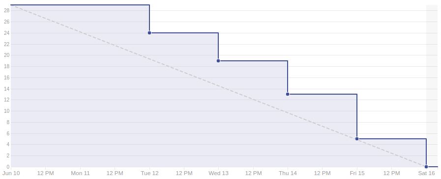

# Sprint 14

## Duração

De 10 de Junho de 2018 (10/06/2018) à 16 de Junho de 2018 (16/06/2018).

## Histórias de Usuário concluídas

|Issue| Descrição|Pontuação|Origem|Resultado|
|-|-|-|-|-|
|([#148](https://github.com/fga-gpp-mds/2018.1-VoxPop-WebApp/issues/148))|USF25 Continuar com Facebook|5|Nova|Sucesso|
|([#146](https://github.com/fga-gpp-mds/2018.1-VoxPop-WebApp/issues/146))|TS06 Aplicar conceitos de usabilidade|3|Nova|Sucesso|
|([#145](https://github.com/fga-gpp-mds/2018.1-VoxPop-WebApp/issues/145))|USF24 Entre em contato conosco|3|Nova|Sucesso|
|([#144](https://github.com/fga-gpp-mds/2018.1-VoxPop-WebApp/issues/144))|Filtro de login |5|Nova|Sucesso|
|([#142](https://github.com/fga-gpp-mds/2018.1-VoxPop-WebApp/issues/142))|BF10 - Bug search|1|Nova|Sucesso|
|([#139](https://github.com/fga-gpp-mds/2018.1-VoxPop-WebApp/issues/139))|BF09 - Follow Display|1|Nova|Sucesso|
|([#136](https://github.com/fga-gpp-mds/2018.1-VoxPop-WebApp/issues/136))|BF08 - Ver Meu Perfil Em Linguagem Natural|1|Nova|Sucesso|
|([#93](https://github.com/fga-gpp-mds/2018.1-VoxPop-API/issues/93))|USB25 Continuar com Facebook|5|Nova|Sucesso|
|([#81](https://github.com/fga-gpp-mds/2018.1-VoxPop-API/issues/81))|Implementar HTTPS |5|Nova|Sucesso|

## Produtividade
** Pontos planejados:** 29
 
** Pontos entregues:** 29

# Burndown

# Métricas API
|Métricas|Indicadores|
|-|-|
| **Erros do flake8 por arquivo** | 0 |
| **Métodos com alto número de argumentos** | 0 |
| **Arquivos com alto número de linhas** | 0 |
| **Blocos de código idênticos** | 0 |
| **Blocos de código semelhantes** | 5 |
| **Classes com alto número de métodos** | 0 |
| **Métodos com alto número de linhas** | 0 |
| **Quantidade de estruturas de decisão muito aninhadas** | 0 |
| **Métodos com vários 'return'** | 0 |

# Métricas WebApp
|Métricas|Indicadores|
|-|-|
| **Métodos com alto número de argumentos** | 0 |
| **Arquivos com alto número de linhas** | 0 |
| **Blocos de código idênticos** | 0 |
| **Blocos de código semelhantes** | 7 |
| **Classes com alto número de métodos** | 1 |
| **Métodos com alto número de linhas** | 0 |
| **Quantidade de estruturas de decisão muito aninhadas** | 0 |
| **Métodos com vários 'return'** | 0 |

# Retrospectiva

## O que foi bom
- Foi entregue todo o planejado
- Produtividade estavel
- Resultados dos testes de usabilidade utilizados
- Entrega contínua
- Bugs foram resolvidos
- Escopo foi fechado
- Foram entregues funcionalidades fora do escopo
- Cobertura de testes subiu

## O que foi ruim
- Professora requisitou nova funcionalidade faltando 2 sprints
- Falta de tempo
- Membros de EPS ocupados com a disciplina de Desenho
- Documentos de EPS não estão acessíveis

## O que pode melhorar
- Cobertura de testes
- Visualização das informações obtidas pela aplicação

### Análise do Scrum Master
Nessa sprint focamos na entrega de componenetes do front end para agregar valor à aplicação para o usuário, foi focada principalmente em histórias que aumentassem a usabilidade do usuário na aplicação, foram corrigidos problemas na usabilidade encontrados nos testes de usabilidade, assim como outros problemas que já haviam sido detectados na aplicação. Segundo o feedback da professora Carla, era de grande importancia que a nossa aplicação possuísse integração de login com o Facebook, por isso essa funcionalidade não planejada foi imediatamente alocada para essa sprint.

[Voltar](./../)
