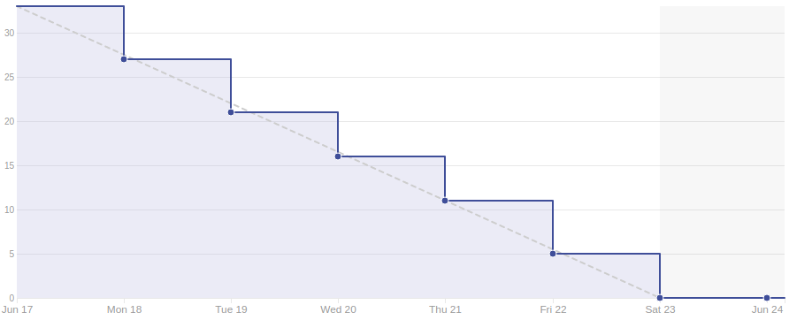

# Sprint 15

## Duração

De 17 de Junho de 2018 (17/06/2018) à 24 de Junho de 2018 (24/06/2018).

## Histórias de Usuário concluídas

|Issue| Descrição|Pontuação|Origem|Resultado|
|-|-|-|-|-|
|([#160](https://github.com/fga-gpp-mds/2018.1-VoxPop-WebApp/issues/160))|TS05 – Criar página de termos de serviço|2|Nova|Sucesso|
|([#159](https://github.com/fga-gpp-mds/2018.1-VoxPop-WebApp/issues/159))|BF12 - Bug cookies autenticação|1|Nova|Sucesso|
|([#158](https://github.com/fga-gpp-mds/2018.1-VoxPop-WebApp/issues/158))|USF28 – Ver ranking de deputados seguidos |3|Nova|Sucesso|
|([#157](https://github.com/fga-gpp-mds/2018.1-VoxPop-WebApp/issues/157))|USF27 – Ver data de atualização de uma proposição|2|Nova|Sucesso|
|([#156](https://github.com/fga-gpp-mds/2018.1-VoxPop-WebApp/issues/156))|USF26 – Ver análise social de uma proposição|5|Nova|Sucesso|
|([#153](https://github.com/fga-gpp-mds/2018.1-VoxPop-WebApp/issues/153))|BF11 - Tratar retorno de objetos inexistentes|1|Nova|Sucesso|
|([#147](https://github.com/fga-gpp-mds/2018.1-VoxPop-WebApp/issues/147))|USF23 Ver quadro de proposições dos deputados|5|Nova|Sucesso|
|([#99](https://github.com/fga-gpp-mds/2018.1-VoxPop-API/issues/99))|USB28 – Ver ranking de deputados seguidos|2|Nova|Sucesso|
|([#98](https://github.com/fga-gpp-mds/2018.1-VoxPop-API/issues/98))|USB27 – Ver data de atualização de uma proposição |2|Nova|Sucesso|
|([#97](https://github.com/fga-gpp-mds/2018.1-VoxPop-API/issues/97))|USB26 – Ver análise social de uma proposição|5|Nova|Sucesso|
|([#92](https://github.com/fga-gpp-mds/2018.1-VoxPop-API/issues/92))|USB26 – Ver análise social de uma proposição|5|Nova|Sucesso|

## Produtividade
** Pontos planejados:** 33
 
** Pontos entregues:** 33

# Burndown

# Métricas API
|Métricas|Indicadores|
|-|-|
| **Erros do flake8 por arquivo** | 0 |
| **Métodos com alto número de argumentos** | 0 |
| **Arquivos com alto número de linhas** | 0 |
| **Blocos de código idênticos** | 0 |
| **Blocos de código semelhantes** | 2 |
| **Classes com alto número de métodos** | 0 |
| **Métodos com alto número de linhas** | 0 |
| **Quantidade de estruturas de decisão muito aninhadas** | 0 |
| **Métodos com vários 'return'** | 0 |

# Métricas WebApp
|Métricas|Indicadores|
|-|-|
| **Métodos com alto número de argumentos** | 0 |
| **Arquivos com alto número de linhas** | 0 |
| **Blocos de código idênticos** | 4 |
| **Blocos de código semelhantes** | 25 |
| **Classes com alto número de métodos** | 1 |
| **Métodos com alto número de linhas** | 2 |
| **Quantidade de estruturas de decisão muito aninhadas** | 0 |
| **Métodos com vários 'return'** | 0 |

# Retrospectiva

## O que foi bom
- Foi entregue todo o planejado
- Produtividade estavel
- Resultados dos testes de usabilidade utilizados
- Entrega contínua
- Bugs foram resolvidos
- Foram entregues funcionalidades fora do escopo
- Cobertura de testes subiu

## O que foi ruim
- Falta de tempo
- Todos os membros estavam ocupados com o final do semestre

## O que pode melhorar
- Alcance da aplicação

### Análise do Scrum Master
Essa é a ultima entrega do projeto, tendo isso em mente é possível observar o amadurecimento do time, que foi capaz de entregar um produto de software que atende as especificações do planejado inicialmente. Nessa sprint tivemos a chance de adicionar funcionalidades que não faziam parte do escopo inicial, mas que ao longo da execução do projeto percebemos que poderiam agregar valor à aplicação. As funcionalidades adicionadas eram em sua maioria formas diferentes de visualizar as estatísticas geradas pela aplicação de acordo com certos filtros. Além disso nessa sprint continuamos a utilizar os resultados dos testes de usabilidade para melhorar a experiência de usuário no site. Nessa sprint fomos capazes de entregar todo o planejado com entregas contínuas e distribuídas ao longo do tempo.
[Voltar](./../)
