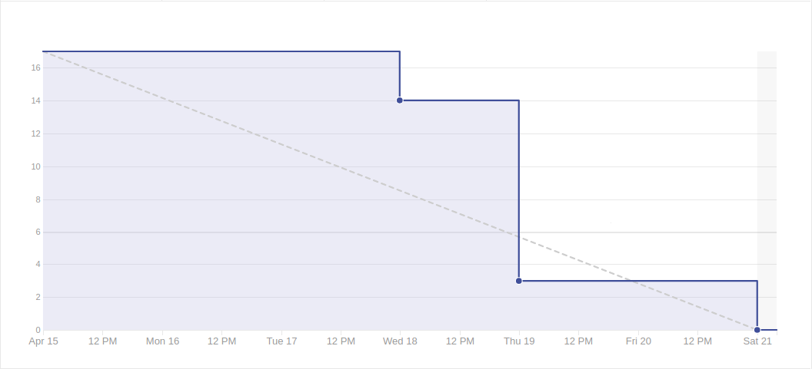

# Sprint 6

## Duração

De 15 de abril de 2018 (15/04/2018) à 21 de abril de 2018 (21/04/2018).

## Atividade planejadas

|Issue| Descrição|Pontuação|Origem|Resultado|
|-|-|-|-|-|
|([#36](https://github.com/fga-gpp-mds/2018.1-VoxPop-WebApp/issues/36))|USF02 - Autenticação de Usuário |3|Sprint 4|Sucesso|
|([#15](https://github.com/fga-gpp-mds/2018.1-VoxPop-API/issues/15))|USB02 - Autenticação de Usuário|3|Sprint 5|Sucesso|
|([#23](https://github.com/fga-gpp-mds/2018.1-VoxPop-API/issues/23))|USB08 – Ver PL Disponíveis|3|Nova|Sucesso|
|([#46](https://github.com/fga-gpp-mds/2018.1-VoxPop-API/issues/46))|TS03 - Melhorar Estilo de Apresentação|8|Nova|Sucesso|

## Produtividade
** Pontos planejados:** 17
 
** Pontos entregues:** 17

# Burndown

# Métricas API
|Métricas|Indicadores|
|-|-|
| **Erros do flake8 por arquivo** | 0 |
| **Métodos com alto número de argumentos** | 0 |
| **Arquivos com alto número de linhas** | 0 |
| **Blocos de código idênticos** | 0 |
| **Blocos de código semelhantes** | 3 |
| **Classes com alto número de métodos** | 1 |
| **Métodos com alto número de linhas** | 0 |
| **Quantidade de estruturas de decisão muito aninhadas** | 0 |
| **Métodos com vários 'return'** | 0 |

# Métricas WebApp
|Métricas|Indicadores|
|-|-|
| **Métodos com alto número de argumentos** | 0 |
| **Arquivos com alto número de linhas** | 0 |
| **Blocos de código idênticos** | 5 |
| **Blocos de código semelhantes** | 47 |
| **Classes com alto número de métodos** | 2 |
| **Métodos com alto número de linhas** | 8 |
| **Quantidade de estruturas de decisão muito aninhadas** | 0 |
| **Métodos com vários 'return'** | 0 |

# Retrospectiva

## O que foi bom
- Autenticação funcionando
- Histórias do back terminadas
- Galera marcando presença
- Autenticação e estilo definido
- Equipe se mantém motivada
- Arquitetura
- Devops
- Pareamento

## O que foi ruim
- Praticamente não teve front
- Issues muito grandes
- Critérios não especificados
- Adquirimos mais dívida
- Comunicação ruim
- Muitos não sabiam o que fazer
- Sem issue o suficiente
- Dívidas
- Problemas de comunicação
- Poucos commits
- Problemas com alguns pareamentos/histórias
- Commitamos pouco
- Todo mundo meio perdido
- Não testou tudo

## O que pode melhorar
- Divisão das issues
- Saber como commitar
- Definição das histórias para cada pessoa
- Quantidade de commits
- Definição dos critérios de aceitação
- Entrega do front
- Constancia dos pareamentos
- Quantidade de testes
- Comunicação

### Análise do Scrum Master
O time de desenvolvimento apresentou uma boa produtividade e foi  possível entregar todas as tarefas antes do fim da Sprint. Alguns membros ainda que possuiam baixa compreensão da arquitetura mostraram-se mais ativos em seus pareamentos durante a Sprint o que resultou em um melhor nivelamento do conhecimento. Nessa sprint conseguimos entregar a nossa dívida técnica.
Durante essa Sprint ocorreu a Release 1 do projeto.

[Voltar](./../)
