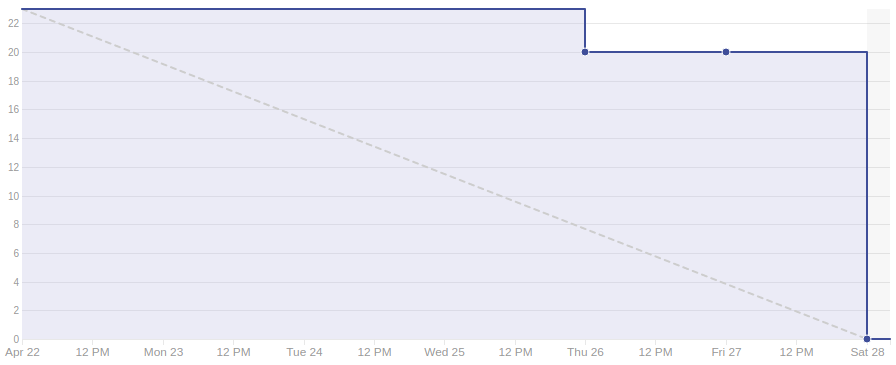

# Sprint 7

## Duração

De 22 de abril de 2018 (22/04/2018) à 28 de abril de 2018 (28/04/2018).

## Atividade planejadas

|Issue| Descrição|Pontuação|Origem|Resultado|
|-|-|-|-|-|
|([#77](https://github.com/fga-gpp-mds/2018.1-VoxPop-WebApp/issues/77))|Sidebar |3|Nova|Sucesso|
|([#46](https://github.com/fga-gpp-mds/2018.1-VoxPop-WebApp/issues/46))|USF11 – Alterar Voto em PL|5|Nova|Sucesso|
|([#45](https://github.com/fga-gpp-mds/2018.1-VoxPop-WebApp/issues/45))|USF10 – Votar um PL|8|Nova|Sucesso|
|([#41](https://github.com/fga-gpp-mds/2018.1-VoxPop-WebApp/issues/41))|USF06 – Ver Minhas PLs Votadas|5|Nova|Sucesso|
|([#25](https://github.com/fga-gpp-mds/2018.1-VoxPop-API/issues/25))|USB10 – Votar um PL|2|Nova|Sucesso|

## Produtividade
** Pontos planejados:** 23
 
** Pontos entregues:** 23

# Burndown

# Métricas API
|Métricas|Indicadores|
|-|-|
| **Erros do flake8 por arquivo** | 0 |
| **Métodos com alto número de argumentos** | 0 |
| **Arquivos com alto número de linhas** | 1 |
| **Blocos de código idênticos** | 0 |
| **Blocos de código semelhantes** | 7 |
| **Classes com alto número de métodos** | 0 |
| **Métodos com alto número de linhas** | 1 |
| **Quantidade de estruturas de decisão muito aninhadas** | 0 |
| **Métodos com vários 'return'** | 0 |

# Métricas WebApp
|Métricas|Indicadores|
|-|-|
| **Métodos com alto número de argumentos** | 0 |
| **Arquivos com alto número de linhas** | 0 |
| **Blocos de código idênticos** | 2 |
| **Blocos de código semelhantes** | 38 |
| **Classes com alto número de métodos** | 1 |
| **Métodos com alto número de linhas** | 2 |
| **Quantidade de estruturas de decisão muito aninhadas** | 0 |
| **Métodos com vários 'return'** | 0 |

# Retrospectiva

## O que foi bom
- Histórias do front entregues
- Participação de todos
- Novo épico iniciado
- Scrum master putasso
- Todo o planejado foi entregue
- Melhora na comunicação

## O que foi ruim
- Front tá saindo
- Issues muito grandes
- Poucos commits
- Muitas issues
- Burndown muito ruim
- Scrum master putasso

## O que pode melhorar
- Saber como commitar
- Quantidade de commits
- Quantidade de testes
- Entrega contínua

### Análise do Scrum Master
Durante essa sprint focamos em desenvolver histórias do front end para que pudessemos agregar valor ao usuário. Nessa sprint também foi um dos nossos objetivos aumentar a nossa produtividade. Houve uma troca nos papéis e o novo Scrum master agora é o **Breno Mariz**, enquanto o antigo, **André Bedran**, agora é o arquiteto. A equipe mostrou maior maturidade em relação as sprints anteriores e foi possível cumprir com o planejado.

[Voltar](./../)
