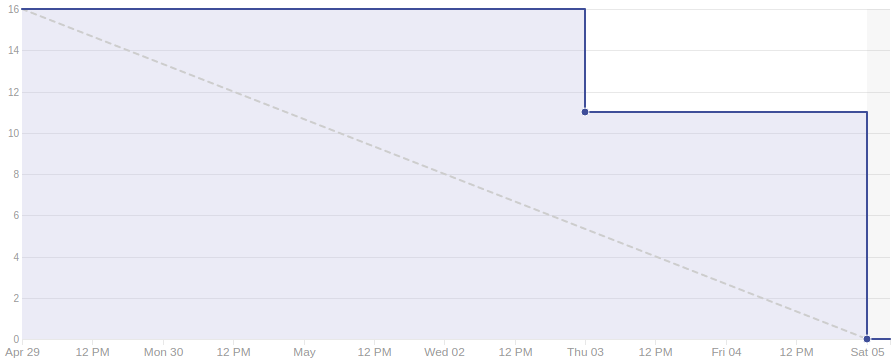

# Sprint 8

## Duração

De 29 de Abril de 2018 (29/04/2018) à 05 de Maio de 2018 (05/05/2018).

## Atividade planejadas

|Issue| Descrição|Pontuação|Origem|Resultado|
|-|-|-|-|-|
|([#43](https://github.com/fga-gpp-mds/2018.1-VoxPop-WebApp/issues/43))|USF08 – Ver PL Disponíveis|5|Nova|Sucesso|
|([#40](https://github.com/fga-gpp-mds/2018.1-VoxPop-WebApp/issues/40))|USF05 – Editar Informações Socioeconômicas |3|Nova|Sucesso|
|([#39](https://github.com/fga-gpp-mds/2018.1-VoxPop-WebApp/issues/39))|USF04 – Editar Informações Pessoais |3|Nova|Sucesso|
|([#38](https://github.com/fga-gpp-mds/2018.1-VoxPop-WebApp/issues/38))|USF03 – Visualizar Meu Perfil |5|Nova|Sucesso|

## Produtividade
** Pontos planejados:** 16
 
** Pontos entregues:** 16

# Burndown

# Métricas API
|Métricas|Indicadores|
|-|-|
| **Erros do flake8 por arquivo** | 0 |
| **Métodos com alto número de argumentos** | 5 |
| **Arquivos com alto número de linhas** | 2 |
| **Blocos de código idênticos** | 0 |
| **Blocos de código semelhantes** | 13 |
| **Classes com alto número de métodos** | 0 |
| **Métodos com alto número de linhas** | 2 |
| **Quantidade de estruturas de decisão muito aninhadas** | 0 |
| **Métodos com vários 'return'** | 0 |

# Métricas WebApp
|Métricas|Indicadores|
|-|-|
| **Métodos com alto número de argumentos** | 0 |
| **Arquivos com alto número de linhas** | 0 |
| **Blocos de código idênticos** | 1 |
| **Blocos de código semelhantes** | 34 |
| **Classes com alto número de métodos** | 1 |
| **Métodos com alto número de linhas** | 1 |
| **Quantidade de estruturas de decisão muito aninhadas** | 0 |
| **Métodos com vários 'return'** | 0 |

# Retrospectiva

## O que foi bom
- MDS trabalhou bem
- Histórias foram finalizadas dessa sprint
- Pareamentos funcionaram bem
- Galera se ajudando

## O que foi ruim
- Baixa participação de EPS
- Todo mundo cheio de coisas de outras materias
- Testes estão com erro
- Endpoints com bugs
- Burndown muito ruim

## O que pode melhorar
- A presença de membros de EPS
- Gestão de tempo dos membros
- A participação dos membros
- A qualidade dos testes
- Conhecimento sobre testes
- Entrega contínua

### Análise do Scrum Master
Nessa sprint assim como na sprint anterior focamos na entrega de componenetes do front end para agregar valor à aplicação para o usuário, foi focada principalmente em histórias que aumentassem a usabilidade do usuário na aplicação. Nessa sprint houve uma queda na produtividade devido ao comprometimento de membros da equipe com outras matérias (especialmente EDA, e Desenho), assim como problemas de saude de dois membros que se acidentaram, porém isso foi levado em consideração durante o planejado e tentamos mitigar isso planejando uma sprint mais leve e escolhendo histórias mais relevantes para não prejudicar o projeto. Com tudo isso, foi possível entregar todas as histórias planejadas.

[Voltar](./../)
