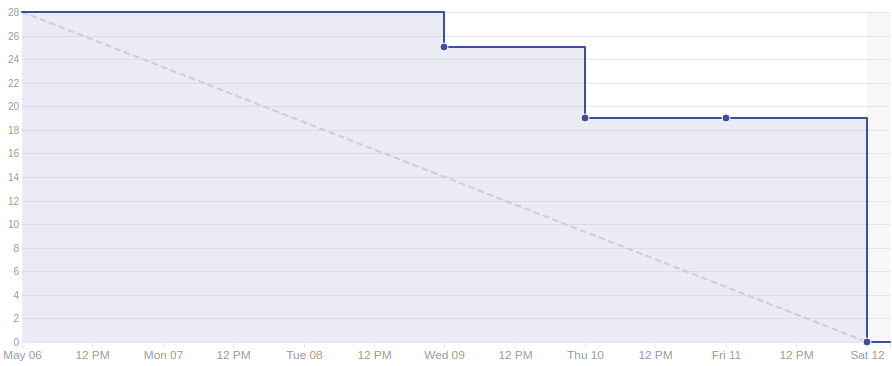

# Sprint 9

## Duração

De 06 de Maio de 2018 (06/05/2018) à 12 de Maio de 2018 (12/05/2018).

## Atividades planejadas

|Issue| Descrição|Pontuação|Origem|Resultado|
|-|-|-|-|-|
|([#102](https://github.com/fga-gpp-mds/2018.1-VoxPop-WebApp/issues/102))|Modificar o estilo de componentes das páginas de perfil e dê sua opnião|3|Nova|Sucesso|
|([#73](https://github.com/fga-gpp-mds/2018.1-VoxPop-WebApp/issues/73))|USF20 - Visualizar últimas proposições |5|Nova|Sucesso|
|([#60](https://github.com/fga-gpp-mds/2018.1-VoxPop-WebApp/issues/60))|BF02 - Arrumar bug da edição de usuário |3|Nova|Falha|
|([#49](https://github.com/fga-gpp-mds/2018.1-VoxPop-WebApp/issues/49))|USF14 – Ver Deputado Detalhado|3|Nova|Sucesso|
|([#47](https://github.com/fga-gpp-mds/2018.1-VoxPop-WebApp/issues/47))|USF12 – Listar Todos Deputados |3|Nova|Sucesso|
|([#44](https://github.com/fga-gpp-mds/2018.1-VoxPop-WebApp/issues/44))|USF09 – Ver PL Detalhado |3|Nova|Sucesso|
|([#42](https://github.com/fga-gpp-mds/2018.1-VoxPop-WebApp/issues/42))|USF07 – Procurar Proposição|2|Nova|Sucesso|
|([#62](https://github.com/fga-gpp-mds/2018.1-VoxPop-API/issues/62))|USB20 - Visualizar últimas proposições|1|Nova|Sucesso|
|([#59](https://github.com/fga-gpp-mds/2018.1-VoxPop-API/issues/59))|Pegar mais informações do parlamentar|3|Nova|Sucesso|
|([#22](https://github.com/fga-gpp-mds/2018.1-VoxPop-API/issues/22))|USB07 – Procurar proposição |5|Nova|Sucesso|

## Produtividade
** Pontos planejados:** 31
 
** Pontos entregues:** 28

# Burndown

# Métricas API
|Métricas|Indicadores|
|-|-|
| **Erros do flake8 por arquivo** | 0 |
| **Métodos com alto número de argumentos** | 0 |
| **Arquivos com alto número de linhas** | 0 |
| **Blocos de código idênticos** | 0 |
| **Blocos de código semelhantes** | 20 |
| **Classes com alto número de métodos** | 0 |
| **Métodos com alto número de linhas** | 0 |
| **Quantidade de estruturas de decisão muito aninhadas** | 0 |
| **Métodos com vários 'return'** | 0 |

# Métricas WebApp
|Métricas|Indicadores|
|-|-|
| **Métodos com alto número de argumentos** | 0 |
| **Arquivos com alto número de linhas** | 1 |
| **Blocos de código idênticos** | 2 |
| **Blocos de código semelhantes** | 25 |
| **Classes com alto número de métodos** | 1 |
| **Métodos com alto número de linhas** | 0 |
| **Quantidade de estruturas de decisão muito aninhadas** | 0 |
| **Métodos com vários 'return'** | 1 |

# Retrospectiva

## O que foi bom
- Scrum Master presente
- Fizemos mais US do front do que o planejado
- Front tá indo liso
- Corrigindo bugs
- EPS presente
- Melhora no burndown

## O que foi ruim
- Muita gente faltou a reunião
- Problemas com conflitos do GIT
- Sdds um terço da equipe de MDS
- Conhecimento do back bem desnivelado
- Adiquirimos dívida técnica

## O que pode melhorar
- Conhecimento do GIT
- Nivelamento do conhecimento
- Produtividade de MDS
- Entrega contínua

### Análise do Scrum Master
Nessa sprint focamos na entrega de componenetes do front end para agregar valor à aplicação para o usuário. Foi priorizado principalmente histórias que melhorem a facilidade do usuário navegar e encontrar recursos dentro da aplicação. Aumentar a produtividade era um dos objetivos, e que foi parcialmente alcançado, a equipe de desenvolvimento principalmente cresceu bastante, porém devido a problemas com a API da camara não foi possível entregar todas as histórias planejadas. Com isso a foi gerada uma dívida técnica de 3 pontos.

[Voltar](./../)
