# Burndown de Riscos
Os riscos foram analisados e monitorados durante as 15 sprints do projeto. A análise detalhada encontram-se no link a seguir, e logo abaixo será exibido graficamente a análise individual de cada risco   

[Clique aqui para visualizar a versão completa na planilha](https://docs.google.com/spreadsheets/d/1yBz6Zb7uJyTeoIlVK0-4nztAzV4mPScqFV56f10uicE/edit?usp=sharing)

  
[Clique aqui para ampliar](images/Geral.png)  

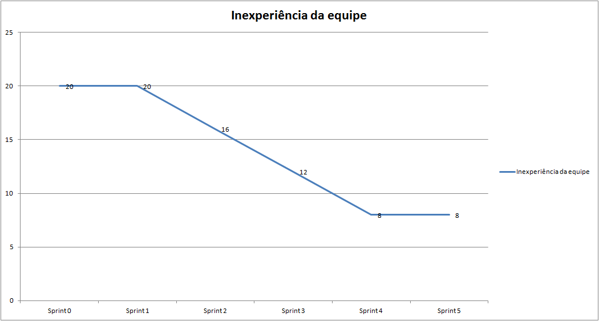  
[Clique aqui para ampliar](images/R01.png)

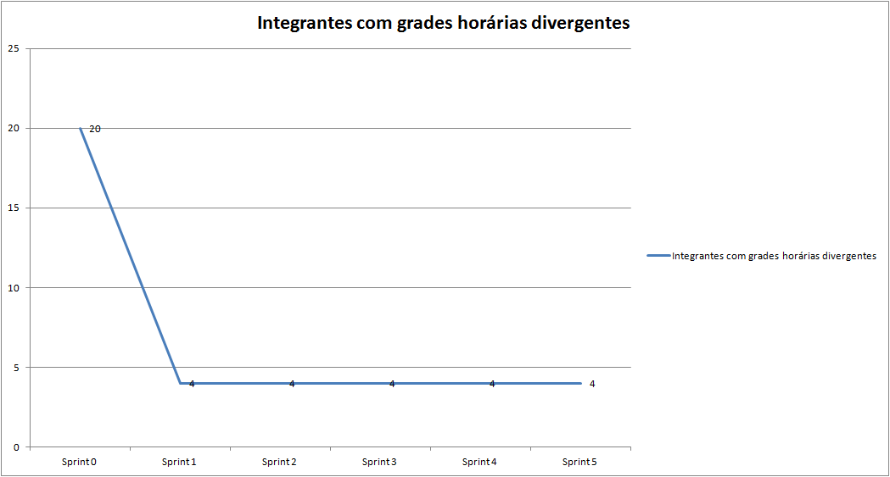  
[Clique aqui para ampliar](images/R02.png)

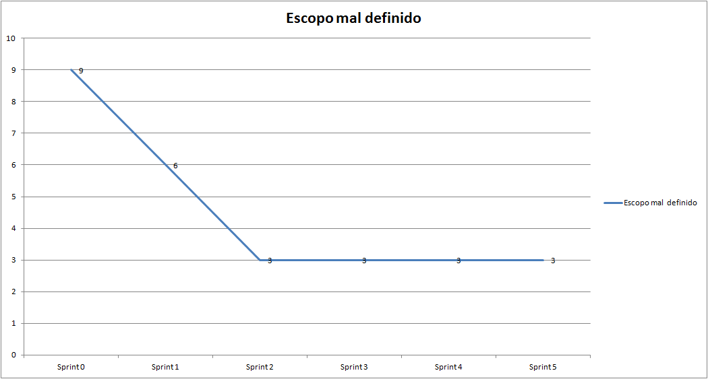  
[Clique aqui para ampliar](images/R03.png)

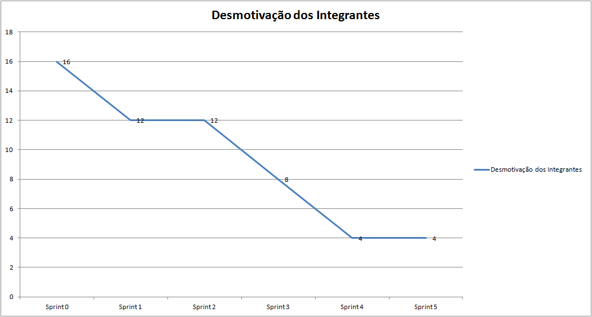  
[Clique aqui para ampliar](images/R04.png)

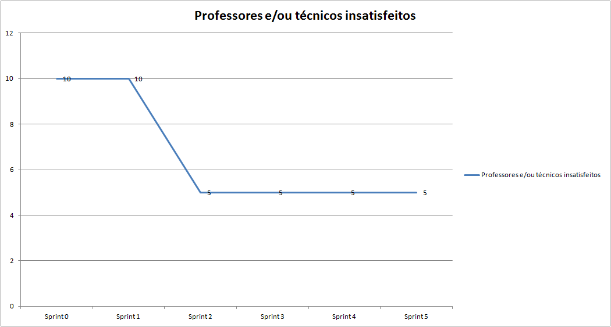  
[Clique aqui para ampliar](images/R05.png)

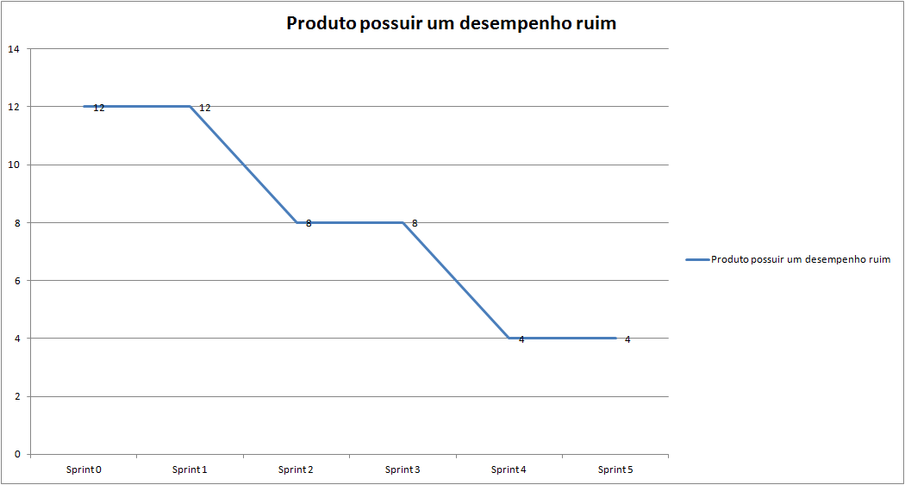  
[Clique aqui para ampliar](images/R06.png)

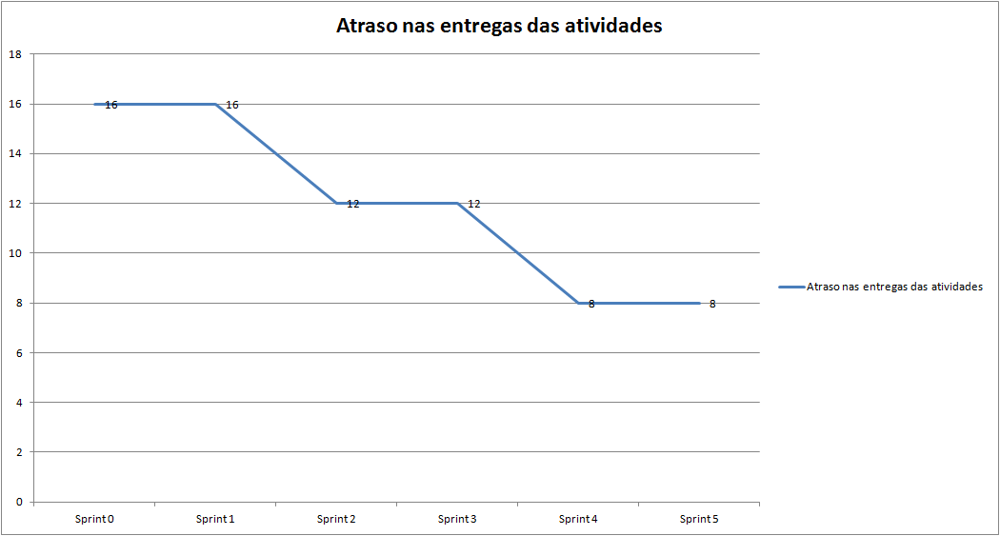  
[Clique aqui para ampliar](images/R07.png)

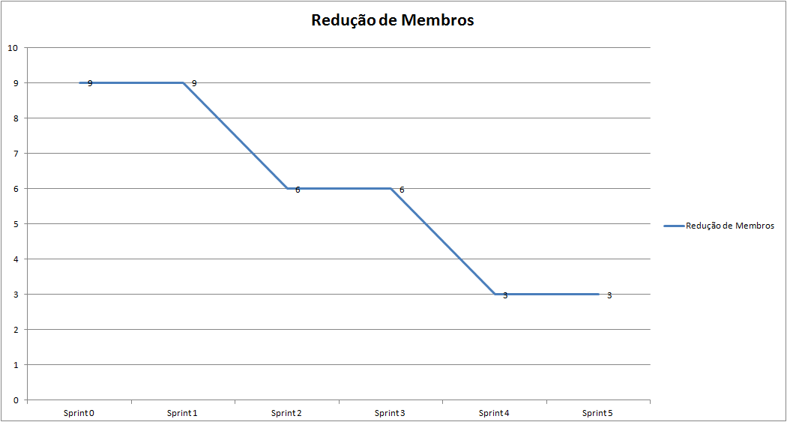  
[Clique aqui para ampliar](images/R08.png)

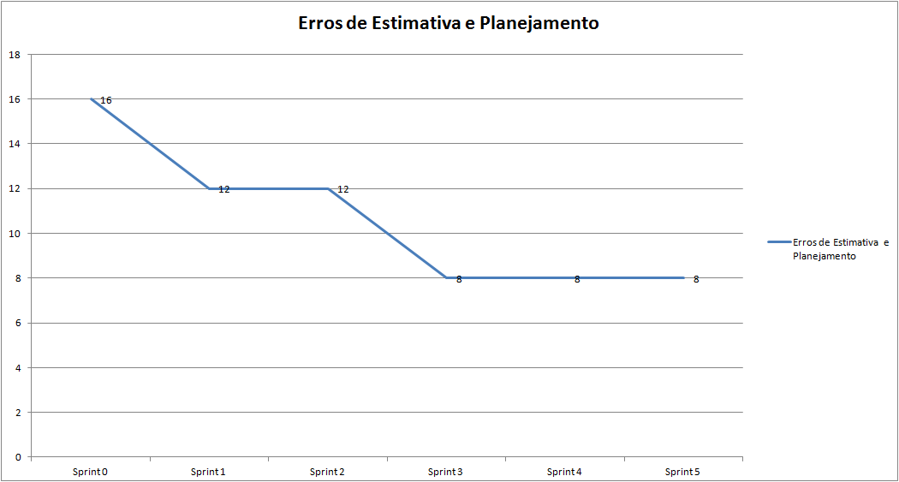  
[Clique aqui para ampliar](images/R09.png)

  
[Clique aqui para ampliar](images/R10.png)

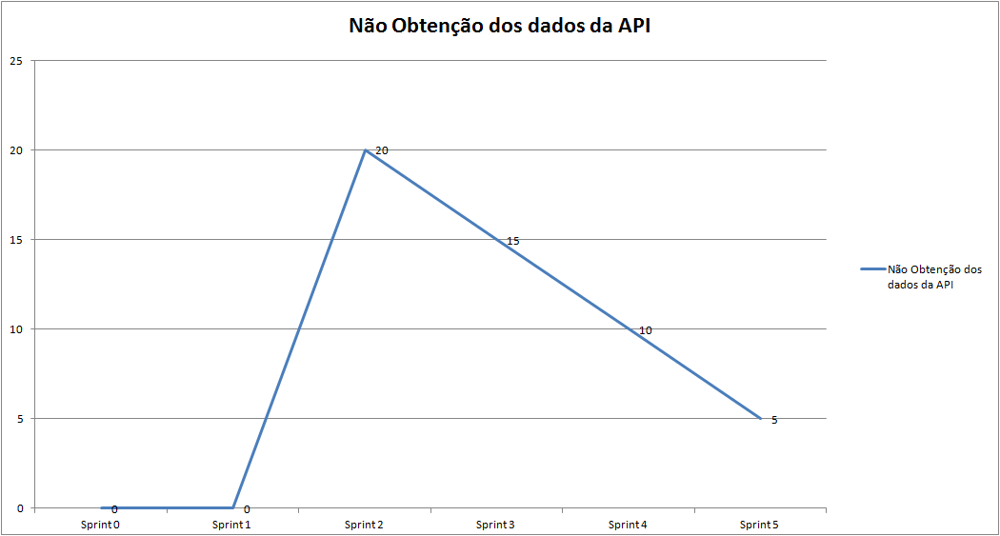  
[Clique aqui para ampliar](images/R11.png)

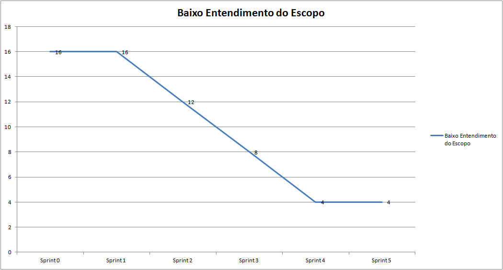  
[Clique aqui para ampliar](images/R12.png)

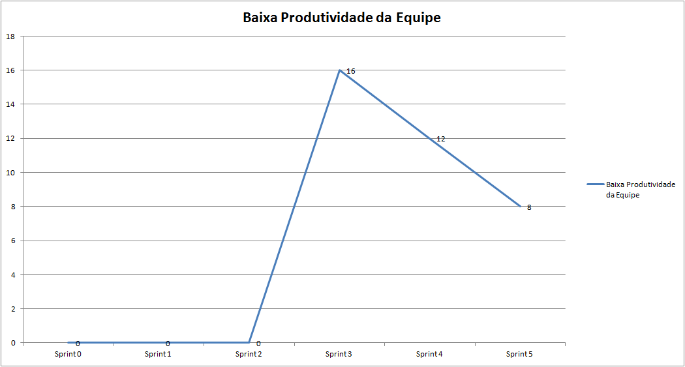  
[Clique aqui para ampliar](images/R13.png)

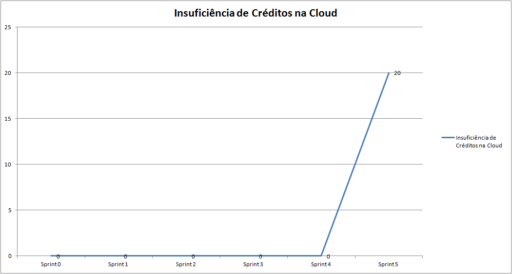  
[Clique aqui para ampliar](images/R14.png)

[Voltar](./../)
