# Teste de Usabilidade

## Introdução
Esse relatório compreende o teste de Usabilidade do VoxPop ao qual foram selecionados usuários reais para compreenderem as suas dificuldades ao utilizarem o produto, visando descobrir problemas e pontos de melhoria. O software não estava completamente desenvolvido quando iniciaram os testes de usabilidade, por isso funcionou como uma especie de protótipo para validar e melhorar o produto que estava sendo desenvolvido.

## Definir o grupo de usuários:
O VoxPop tem como público alvo todo e qualquer cidadão brasileiro ativo e que tenha direito a voto nas eleições, ou seja, jovens acima de 16 anos e que possua o título de eleitor. O sistema deve ser simples e acessível para a maior quantidade possível de pessoas, ou seja, independer do grau de escolaridade do usuário.

## 1° Teste de Usabilidade – Realizado em: 27 de Maio de 2018
Usuário: Marcos Bernardino de Freitas

Idade: 33 anos

Formação: Ensino Superior completo – Administração de Empresas

Grau de satisfação: 3/10

Comentários ou problemas: Muito pouco intuitivo, tive dificuldade de manusear

Usuário: Luciana Brito Moreira

Idade: 32 anos

Formação: Ensino Médio Completo

Grau de satisfação: 2/10

Comentários ou problemas: Fiquei perdida, não consegui usar direito.

## Procedimentos
Foram selecionados os usuários para fazer o teste 1 de usabilidade, sendo 1 de cada vez, não tendo nenhum contato com o outro durante a realização do mesmo. O usuário foi deixado a vontade em posse do software, pediu-se para utilizar o sistema, tendo como intuito observar a desenvoltura do usuário sozinho, se estava tudo claro, fácil de ser compreendido e se o mesmo conseguiria utilizar o sistema sem qualquer tipo de dificuldade. Caso não e o usuário ficasse travado, o avaliador interviria no teste, fornecendo orientações para o usuário completar a tarefa e seguir para o próximo estágio. Tarefas não realizadas pelo usuário, foram solicitadas suas execuções pelo avaliador de forma que o roteiro de testes fosse executado e analisado

## Objetivo
Usuário conseguir sozinho transpor a interface

## Critério de sucesso
Usuário executar sem qualquer tipo de dificuldade o roteiro de testes.

## Roteiro de testes
1. Cadastrar-se;
2. Efetuar login
3. Ir para a página inicial
4. Visualizar o perfil
5. Editar as informações pessoais
6. Visualizar se as informações foram atualizadas
7. Ir para a página onde são exibidos os Projetos de Lei
8. Visualizar todas as informações a respeito de um projeto de lei específico
9. Votar em um Projeto de Lei (Concordando, Discordando ou Abstendo-se)
10. Visualizar os Projetos de Lei que ele já votou.
11. Pesquisar um Projeto de Lei
12. Editar o próprio voto dado em um Projeto de Lei
13. Visualizar os Deputados
14. Procurar por um Deputado
15. Visualizar as informações específicas de um Deputado
16. Seguir o Deputado
17. Deixar de seguir Deputado
18. Deslogar-se

## Análise
Caso mais de um usuário tiver problema na realização de alguma tarefa, esse fluxo provavelmente deverá ser melhorado

## Resultados
Os usuários tiveram muita dificuldade em utilizar o sistema, tinham poucas informações na página inicial e eles não sabiam exatamente do que se tratava, o que eles teriam que fazer, se era necessário criar uma conta e logar-se ou não, conforme pode-se observar na imagem a seguir:

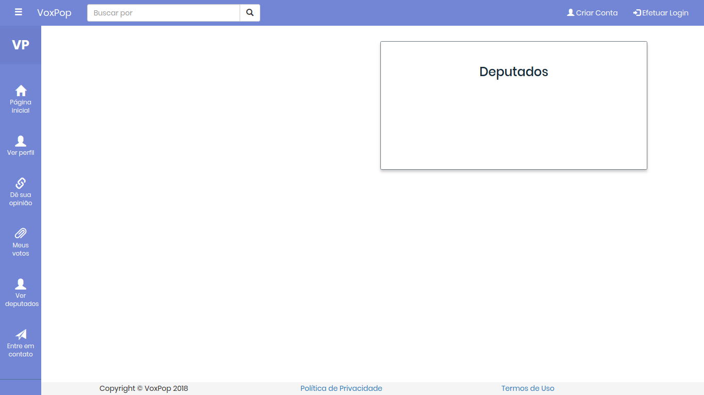  
[Clique aqui para ampliar](images/pagina_inicial.png)

Na página de cadastro, os usuários tiveram dificuldade em se cadastrar, devido aos critérios de validação de senha serem complicados e pouco comuns.

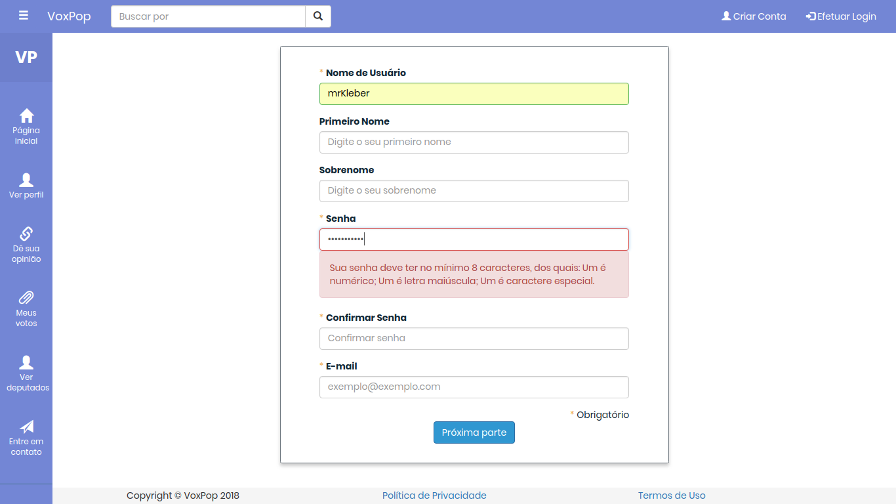  
[Clique aqui para ampliar](images/cadastro.png)  

Após realizar o cadastro e efetuar login, não ficou claro para o usuário que isso que apareceu na tela principal se tratava dos projetos de leis, muito menos qual foi o critério escolhido para eles estarem lá.

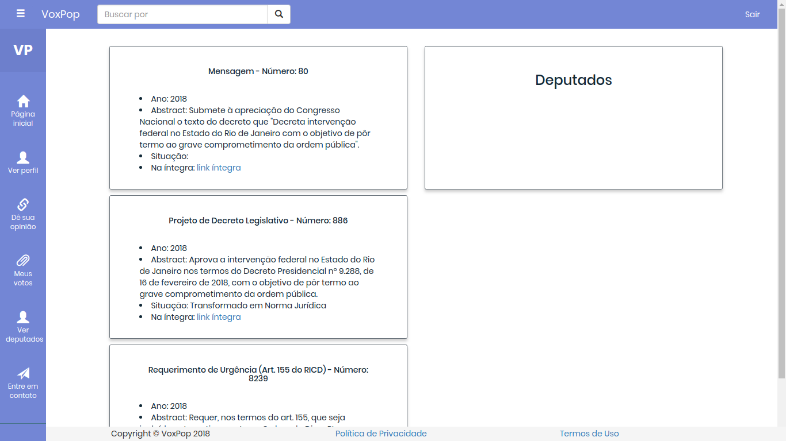  
[Clique aqui para ampliar](images/pagina_inicial_logado.png)

Em meus votos não ficou claro para o usuário qual foi o voto dele (sim, não ou absteve-se) em um determinado projeto de lei.

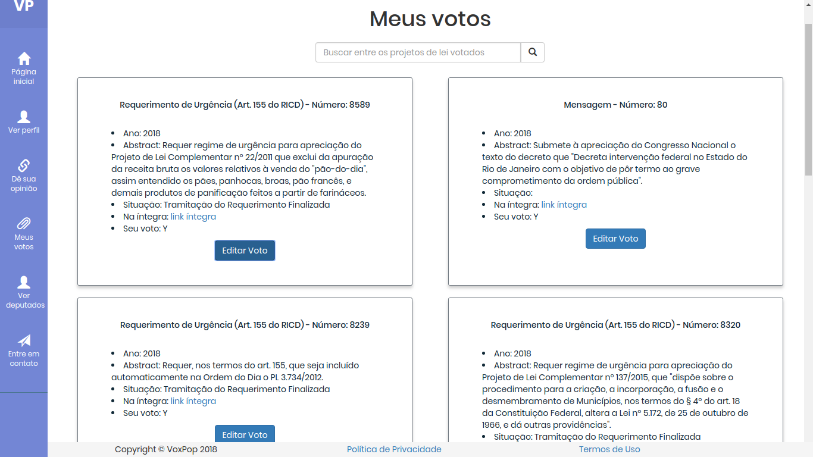  
[Clique aqui para ampliar](images/meus_votos.png)

Já em Dê sua opinião, não ficou completamente explicito do que se tratava cada botão de votação da proposição

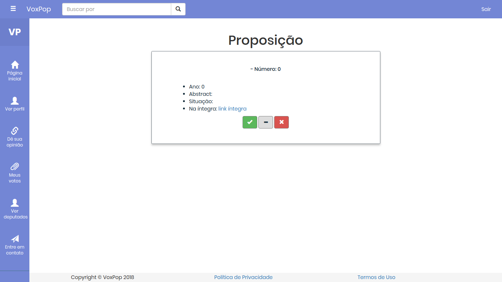  
[Clique aqui para ampliar](images/proposicao.png)

## 2° Teste de Usabilidade – Realizado em: 03 de Junho de 2018
Usuário: Adriana Brito Moreira

Idade: 35 anos

Formação: Ensino Superior completo – Recursos Humanos

Grau de satisfação: 7/10

Comentários ou problemas: Não tive muitas dificuldades ao utilizar, porém pontos de melhorias foram sugeridos

Usuário: Augusto Costa Mendes

Idade: 35 anos

Formação: Ensino Fundamental incompleto

Grau de satisfação: 8/10

Comentários ou problemas: Consegui executar a maioria das coisas.

## Procedimentos
Foram selecionados os usuários para fazer o teste 2 de usabilidade, sendo 1 de cada vez, não tendo assim nenhum contato com o outro durante a realização do mesmo. O usuário foi deixado a vontade em posse do software, pediu-se para utilizar o sistema, tendo como intuito observar a desenvoltura do usuário sozinho, se estava tudo claro, fácil de ser compreendido e se o mesmo conseguiria utilizar o sistema sem qualquer tipo de dificuldade. Caso não e o usuário ficasse travado, o avaliador interviria no teste, fornecendo orientações para o usuário completar a tarefa e seguir para o próximo estágio. Tarefas não realizadas pelo usuário, foram solicitadas suas execuções pelo avaliador de forma que o roteiro de testes fosse executado e analisado

## Objetivo
Usuário conseguir sozinho transpor a interface

## Critério de sucesso
Usuário executar sem qualquer tipo de dificuldade o roteiro de testes

## Roteiro de testes:
1. Cadastrar-se;
2. Efetuar login
3. Ir para a página inicial
4. Visualizar o perfil
5. Editar as informações pessoais
6. Visualizar se as informações foram atualizadas
7. Ir para a página onde são efetuados os votos nos projetos de lei
8. Visualizar todas as informações a respeito de um projeto de lei específico
9. Votar em um Projeto de Lei (Concordando, Discordando ou Abstendo-se)
10.  Visualizar os Projetos de Lei que ele já votou.
11. Editar o próprio voto dado em um Projeto de Lei (Concordando, Discordando ou Abstendo-se)
12. Pesquisar um Projeto de Lei dentre os já votados
13. Ir para a página onde é possível visualizar todos os Deputados
14. Procurar por um Deputado
15. Visualizar as informações específicas de um Deputado
16. Seguir o Deputado
17. Visualizar todos os parlamentares seguidos
18. Deixar de seguir algum Deputado
19. Ir para a página onde são exibidos todas as proposições
20. Visualizar alguma proposição na integra
21. Deslogar-se

## Análise
Caso mais de um usuário tiver problema na realização de alguma tarefa, esse fluxo provavelmente deverá ser melhorado

## Resultados
Com esse novo layout, contendo mais informações e mais intuitivo, os usuários analisados tiveram um desempenho bem melhor em relação as analises anteriores, tendo como pontos de sugestões, melhorias expostos a seguir:

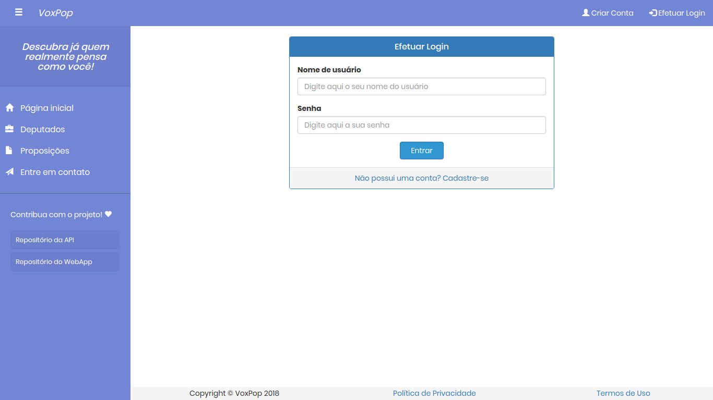  
[Clique aqui para ampliar](images/Login.png)

Ao terminar de realizar o cadastro, ser redirecionado para a página de login, com um indicativo de que ele deve realizar o login para poder ter acesso as funções especiais do sistema

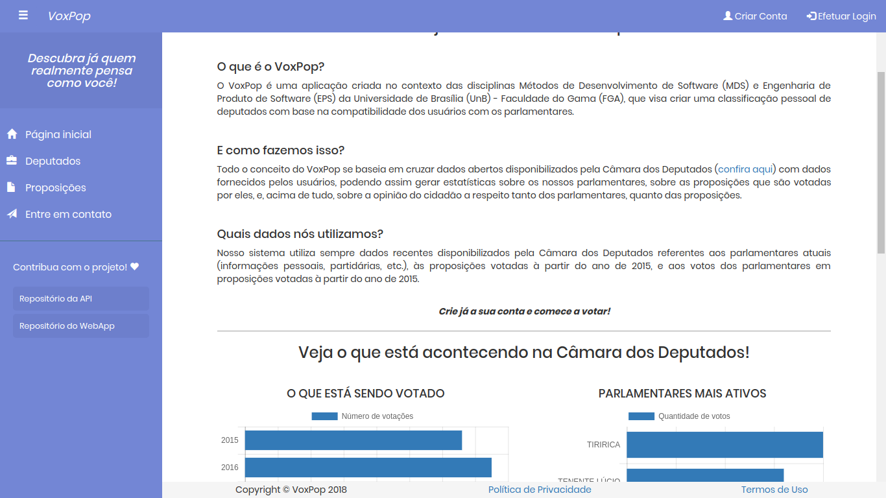  
[Clique aqui para ampliar](images/criar-cadastro.png)

Em Crie já a sua conta e comece a votar!, ter um link para o usuário clicar e ir diretamente para a página onde ele irá criar uma conta

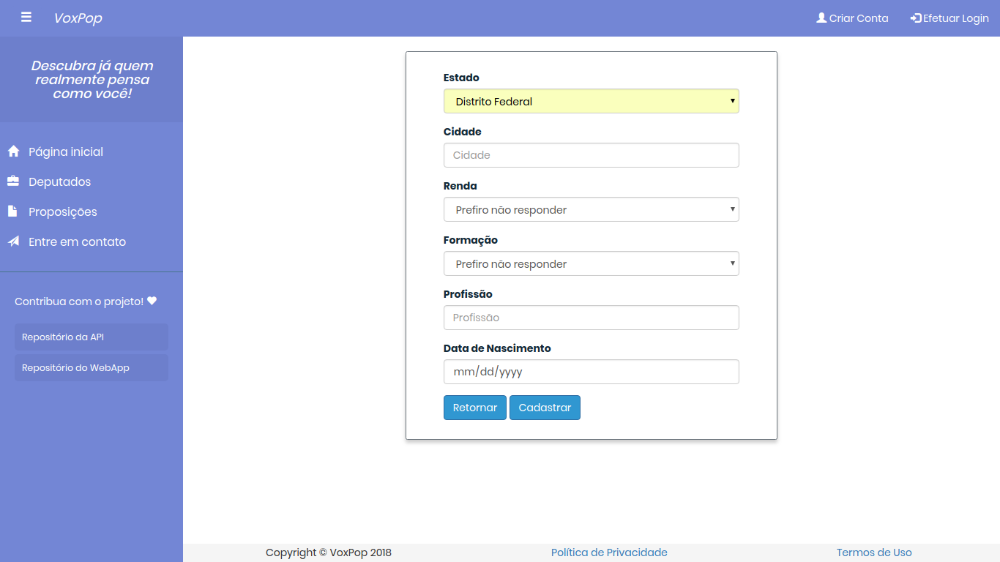  
[Clique aqui para ampliar](images/data-de-nascimento.png)

Alterar data de nascimento para o formato brasileiro: dd/mm/yyyy

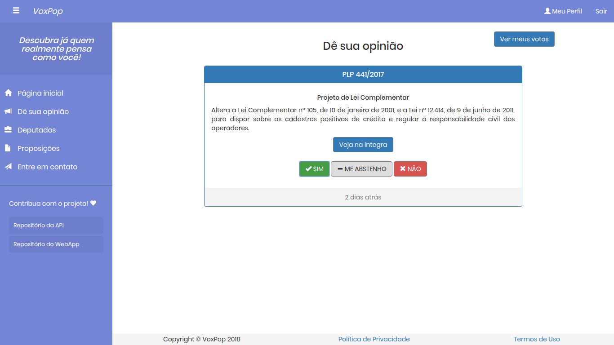  
[Clique aqui para ampliar](images/dias-explicitos.png)

Deixar explicito o que significa esse valor (2 dias atrás)

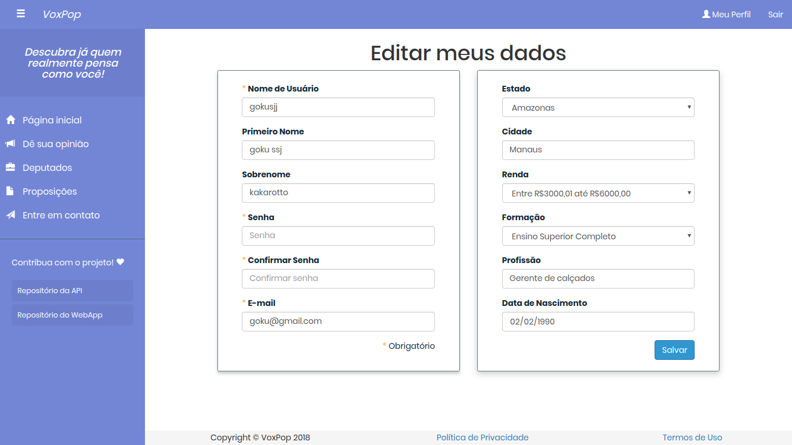  
[Clique aqui para ampliar](images/editar.png)

Informações do lado direito da página editar meus dados, não está atualizando corretamente.

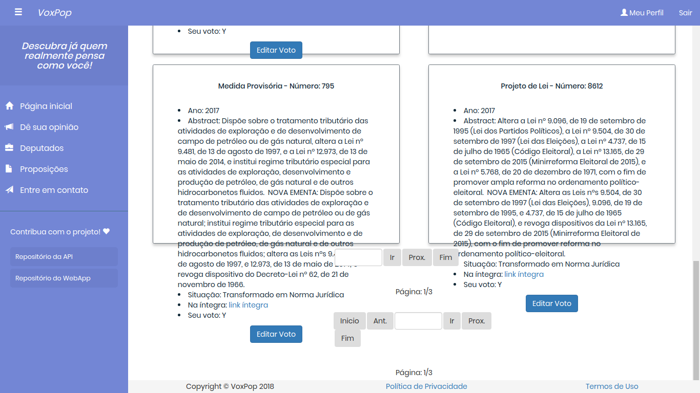  
[Clique aqui para ampliar](images/fora-da-caixa.png)

Arrumar informações com abstract muito grande na página de meus votos, pois o texto está ficando completamente desajustado em relação a página

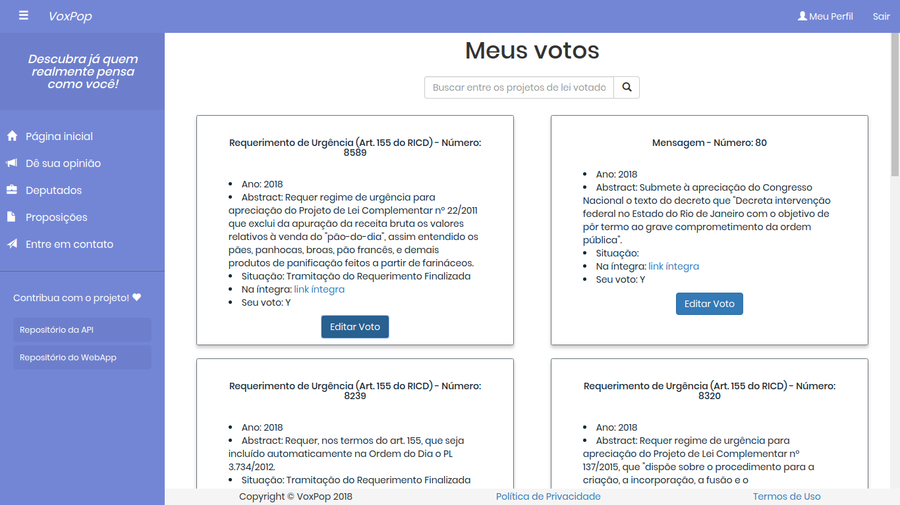  
[Clique aqui para ampliar](images/meus-votos.png)

Deixar claro em seu voto, se o usuário votou em sim/não ou se absteve

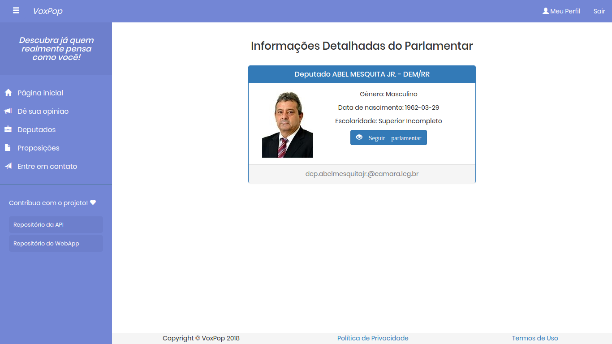  
[Clique aqui para ampliar](images/seguir-deputado.png)

Deixar com maior clareza quais benefícios/funcionalidades o usuário terá ao clicar na opção seguir deputado.

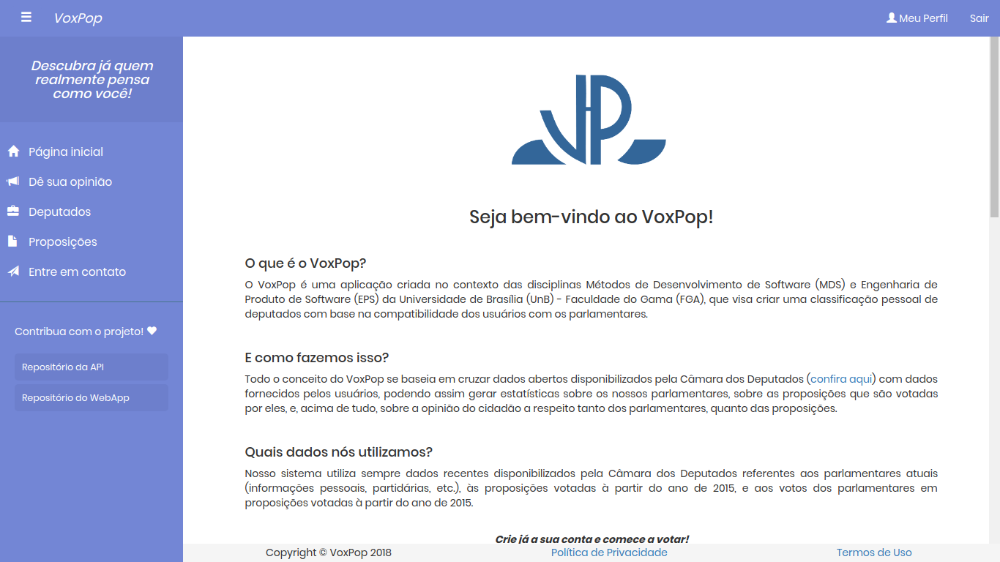  
[Clique aqui para ampliar](images/votar.png)

Trocar o nome dê a sua opinião (para algo como Votar nos Projetos de Lei), pois não está completamente explicito para o usuário que é lá onde ele deve clicar para votar nos PLs

  
[Clique aqui para ampliar](images/dias-explicitos.png)

Informações referentes a meus votos está disponível para ser acessada na página de Dê sua opinião, ficando assim um pouco ocultas do usuário e demandando um pouco de tempo de busca do mesmo para localiza-la quando solicitado.

[Voltar](./../)
